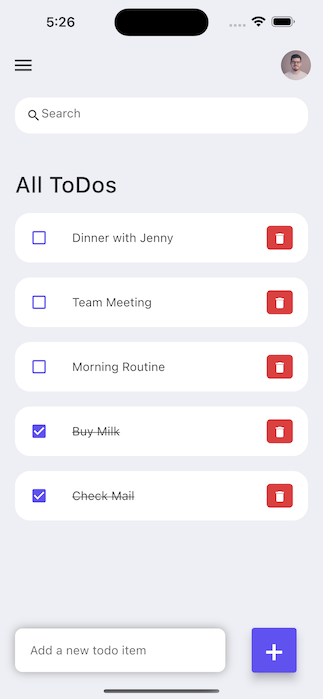

# Flutter ToDo App

This repository contains the code for a ToDo App built using Flutter.  
The tutorial for building this app can be found in this [YouTube video](https://www.youtube.com/watch?v=K4P5DZ9TRns&ab_channel=PradipDebnath) by Pradip Debnath.

## Features

- Add new tasks with a title
- Mark tasks as complete
- Delete tasks
- Search for tasks

## Getting Started

1. Clone the repository to your local machine:
```
git clone https://github.com/nsy13/flutter_todo_tutorial.git
```

2. Navigate to the project directory:
```
cd flutter-todo-app
```

3. Run the app:
```
flutter run
```

The app will start running on your default simulator or device.

## iOS Simulator

If you want to run the app on an iOS simulator, you will need to have Xcode installed on your machine. To launch an iOS simulator, follow these steps:

1. Open Xcode.
2. From the Xcode menu, select "Open Developer Tool" and then select "Simulator".
3. In the Simulator app, select "Hardware" from the menu bar and then select "Device" and choose an iOS simulator from the list.

Once the simulator is running, you can run the app using the `flutter run` command. You can also select the simulator as the target device from within Android Studio or Visual Studio Code.

## Screenshots



## Credits

Thanks to [Pradip Debnath](https://www.youtube.com/channel/UCnv8fK5zL1dR5aMCFQ2yOBA) for the tutorial on which this app is based.
